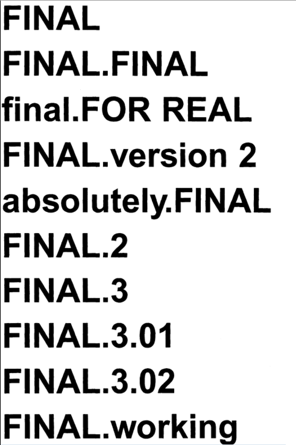
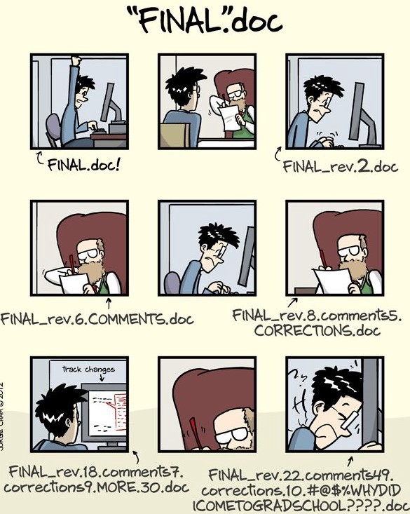
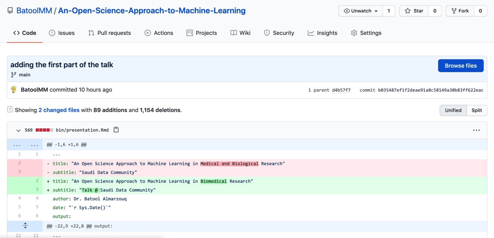
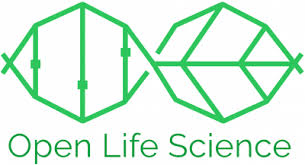
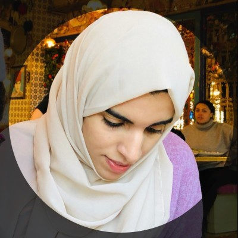
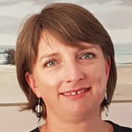
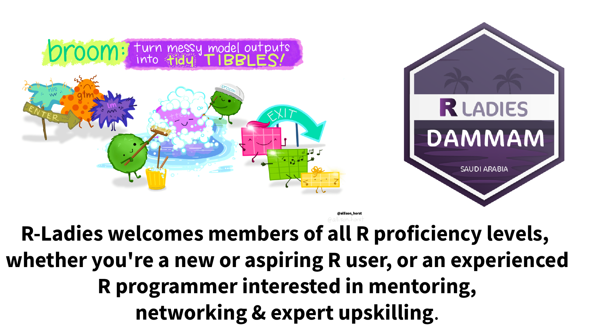

```{r setup, include=FALSE}
options(htmltools.dir.version = FALSE, servr.interval = 0.05)
knitr::opts_chunk$set(collapse = TRUE, fig.retina = 3)
library(xaringanExtra)
library(xaringan)
```

```{r share-again, echo=FALSE}
xaringanExtra::use_share_again()
```

class: title-slide, center, top
background-image: url(figs/PR.jpg)
background-size: contain
background-color: #FFFFFF
background-position: bottom
background-size: 65%


#### `r rmarkdown::metadata$title`

#### `r rmarkdown::metadata$author`- @batool664

---

class: left, inverse

# A little bit about me!

- A computational biologist affiliated with the University of Liverpool.
- Founder of RLadies Chapter in Saudi Arabia (Dammam).
- A curator in the R Weekly team.
- Member of MiR accessibility committee.
- Member in the turing way community.
- Working on establishing an Open Science community in Saudi Arabia.

# Acknowledgment

- The Carpentries
- The Turing Way
- Molecular Sciences Software Institute (MolSSI)
- Alison Presmanes Hill (slides)

---

class: inverse, center, middle

# What are we going to learn?

 Introduction to Open Science
 
--
 
 Become a champion of open (data) science
 
--
 
 Intro to Version Control with Git
 
---

class: inverse, center, middle

## The classical way of data analysis is no longer useful?

---

class: inverse, center, middle

## What is the percentage of reproducible research?

---

class: center, middle

background-image: url(figs/reproducibility-circle2.png)
background-size: 90%
background-color: #f3f3f3

.footnote[Credit:  Key results of the survey on reproducibility conducted by Nature in 2016]

---

class: inverse, center, middle

# How can we overcome the reproducibility crisis?

## So, how can we make these methods available and accessible for researchers, while ensuring that scientific results remain reproducible?

---

class: inverse, center, middle

# How can you improve the reproducibility of your data science project?

--

### OPEN SOURCE SOFTWARE

--

### SHARE CODE/ANALYSIS

--

### Share Computational ENVIRONMENT

--

### VERSION CONTROL

--

### TESTING

--

### DOCUMENTATION

--

### OPEN DATA/FAIR DATA

--


### OPEN ACCESS

---

class: inverse, center, middle

# This is called Open Science. 
## Open research aims to transform research by making it more reproducible, transparent, reusable, collaborative, accountable, and accessible to society. It pushes for change in the way that research is carried out and disseminated by digital tools. 

---

class: inverse, center, middle

# Why do we use version control (git)?

---

#### Version Control in the Old Days ..

.pull-left[
]
.pull-right[

]

---

#### Real Version Control (including backup)



---
## In this workshop, you'll learn:

--

#### How vrsion control system can be leveraged as an electronic lab notebook for computational work

--

#### Learn why adding licensing information to a repository is important, and how to choose a proper license

--

#### Make your work easy to cite
---

class: inverse, center, middle

# The 1st part: How to create a repo from your local machine

---

class: inverse, center, middle

# The 2nd part: How to use a public repo in Github
We ill use WiDS-ex repo

---

class: inverse, center, middle

# The 3rd part: How to submit a PR?
We will use glasario repo

---

class: inverse, center, middle

# The 4th part: How to solve any conflict?
Examples from screenshot

---

class: inverse, center, middle

# The 5th part: How to add a licensing information?
We will use WiDS-ex repo

---

class: inverse, center, middle

# The 6th part: How to add a DOI and make your work citable?
We will use WiDS workshop repo

---


class: inverse, center, middle

## What now?

You can easily contributing to open-source, improve employability

You will learn programming and coding, have others review your code.

You will not be (useless) data scientist 

You will start build tools and packages

---

class: center, middle, inverse

## UNESCO is launching international consultations aimed at developing a Recommendation on Open Science for adoption by member states in 2021

--

## There is a network of Open Science Communities in Netherlands, Sweden, Germany, UK and others

---

class: center, left, inverse

## In line with vision 2030, we are starting an Open Science Community in Saudi Arabia.
## It's created and developed with the help of the "Open Life Sciences"


Open Life Sciences (OLS3) program helps individuals and stakeholders in research to become Open Science ambassadors.

---
class: center, left, inverse

We want to provide a place where newcomers and experienced peers interact, inspire each other to embed open science (research) practices and values in their workflows and provide feedback on policies, infrastructures and support services. Together working to make Open Science the norm. So we are calling out to researchers and colleagues in Saudi Arabia.  

.column[

Batool Almarzouq
The University of Liverpool
]
.column[

Founder and director of Talarify, Mentor OLS3
]
.column[

Paula Moraga, Assistant Professor in Statistics for Public Health
(KAUST)
]
.column[
]

---


class: center, middle
background-size: contain
background-color: #FFFFFF
background-position: bottom
background-size: 50%

#### Learn how to make packages, data viz, and more in RLadies



---


class:  inverse

## Resources: 
- [The Turing Way](https://the-turing-way.netlify.app)

- [The CMU ML Blog](https://blog.ml.cmu.edu/2020/08/31/5-reproducibility/)

- [Redesign open science for Asia, Africa and Latin America](https://www.nature.com/articles/d41586-020-03052-3)

- [Open Science Beyond Open Access: For and with communities, A step towards the decolonization of knowledge
](https://zenodo.org/record/3946773#.YCzVmBMzY1I)

- [Embracing science as it is: beyond Nobel-like research](https://www.youtube.com/watch?v=YTwM10Qob5k)

- [Review on the Application of Machine Learning Algorithms in the Sequence Data Mining of DNA](https://www.frontiersin.org/articles/10.3389/fbioe.2020.01032/full)

---

class:  center, middle, inverse

# Thank you so much!

## batool@liverpool.ac.uk

## Twitter: @batool664

## Join RLadiesDammam: @RLadiesDammam
